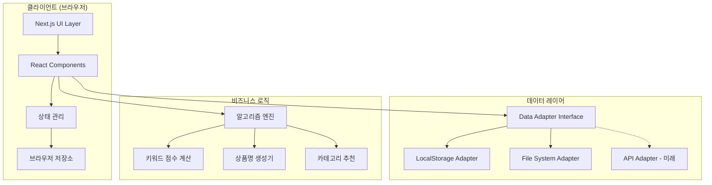
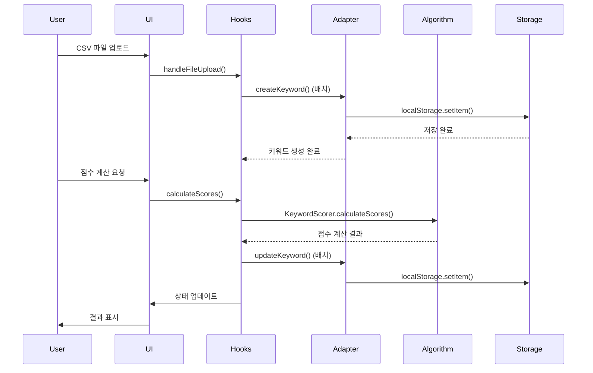
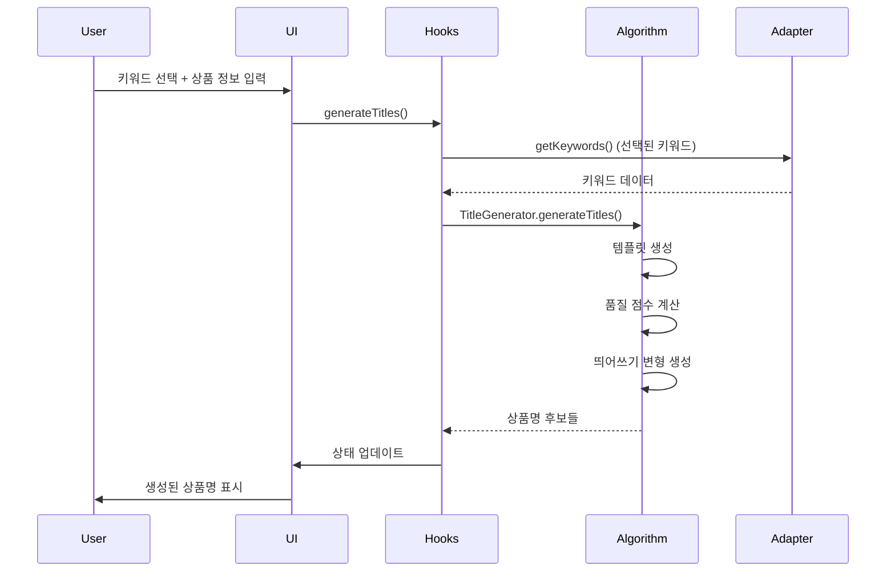

# 스마트스토어 키워드 최적화 - 아키텍처 문서

## 🏗️ 전체 아키텍처 개요

### 시스템 구조


### 핵심 설계 원칙

#### 1. 데이터 어댑터 패턴 (Data Adapter Pattern)
```typescript
// 공통 인터페이스 정의
interface DataSource {
  // 키워드 관련
  getKeywords(filters?: KeywordFilters, sort?: KeywordSortOptions, pagination?: PaginationOptions): Promise<PaginatedResult<Keyword>>;
  createKeyword(data: CreateKeywordData): Promise<Keyword>;
  updateKeyword(id: string, data: Partial<Keyword>): Promise<Keyword>;
  deleteKeyword(id: string): Promise<void>;
  
  // 상품명 관련  
  getProductTitles(filters?: ProductTitleFilters): Promise<ProductTitle[]>;
  createProductTitle(data: CreateProductTitleData): Promise<ProductTitle>;
  
  // 카테고리 관련
  getCategories(): Promise<Category[]>;
  createCategorySuggestion(data: CreateCategorySuggestionData): Promise<CategorySuggestion>;
}
```

#### 2. 확장 가능한 저장소 구조
- **현재**: LocalStorage Adapter (클라이언트 사이드)
- **1단계**: File System Adapter (CSV/JSON 파일)
- **2단계**: API Adapter (RESTful API)
- **3단계**: Database Adapter (PostgreSQL, MongoDB 등)

#### 3. 관심사의 분리 (Separation of Concerns)
- **UI Layer**: 사용자 인터페이스만 담당
- **Business Logic**: 알고리즘과 비즈니스 규칙
- **Data Layer**: 데이터 저장 및 검색
- **Presentation**: 상태 관리 및 데이터 변환

## 📁 프로젝트 구조

```
smartstore-keywords/
├── src/
│   ├── app/                    # Next.js App Router 페이지
│   │   ├── page.tsx           # 홈페이지
│   │   ├── keywords/          # 키워드 리서치
│   │   ├── titles/            # 상품명 생성
│   │   ├── category/          # 카테고리 추천
│   │   ├── checklist/         # 품질 점검
│   │   ├── export/            # 데이터 내보내기
│   │   ├── contact/           # 문의
│   │   ├── policy/            # 정책
│   │   ├── layout.tsx         # 공통 레이아웃
│   │   └── globals.css        # 전역 스타일
│   │
│   ├── components/            # 재사용 가능한 컴포넌트
│   │   ├── forms/             # 폼 관련 컴포넌트
│   │   │   └── FormField.tsx
│   │   ├── layout/            # 레이아웃 컴포넌트
│   │   │   ├── Footer.tsx
│   │   │   └── Navbar.tsx
│   │   └── ui/                # UI 기본 컴포넌트
│   │       ├── Button.tsx
│   │       ├── Card.tsx
│   │       ├── ErrorMessage.tsx
│   │       ├── LoadingSpinner.tsx
│   │       ├── Modal.tsx
│   │       ├── SectionHeading.tsx
│   │       ├── ShareButton.tsx
│   │       └── Toast.tsx
│   │
│   ├── lib/                   # 핵심 비즈니스 로직
│   │   ├── adapters/          # 데이터 어댑터
│   │   │   ├── base.ts        # 기본 인터페이스
│   │   │   ├── factory.ts     # 어댑터 팩토리
│   │   │   ├── index.ts       # 진입점
│   │   │   └── localstorage.ts # LocalStorage 구현
│   │   │
│   │   ├── algorithms/        # 핵심 알고리즘
│   │   │   ├── category-recommender.ts
│   │   │   ├── index.ts
│   │   │   ├── keyword-scoring.ts
│   │   │   └── title-generator.ts
│   │   │
│   │   ├── data/              # 데이터 관련
│   │   │   ├── index.ts
│   │   │   ├── interfaces.ts
│   │   │   └── json-adapter.ts
│   │   │
│   │   ├── utils/             # 유틸리티 함수
│   │   │   ├── checklist-generator.ts
│   │   │   ├── csv-parser.ts
│   │   │   └── index.ts
│   │   │
│   │   ├── types.ts           # 타입 정의
│   │   └── utils.ts           # 공통 유틸리티
│   │
│   └── server/                # 서버 사이드 로직 (미래)
│       └── handlers/          # API 핸들러
│
├── public/                    # 정적 파일
│   ├── images/
│   └── *.svg
│
├── docs/                      # 문서
│   ├── architecture.md
│   ├── deployment.md
│   ├── manual_user.md
│   ├── qa_checklist.md
│   └── requirements.md
│
├── scripts/                   # 빌드/배포 스크립트
├── package.json
├── tsconfig.json
├── tailwind.config.js
├── next.config.js
└── README.md
```

## 🔧 핵심 모듈 설계

### 1. 데이터 어댑터 (Data Adapters)

#### LocalStorage Adapter
```typescript
export class LocalStorageAdapter implements DataSource {
  private readonly STORAGE_KEYS = {
    KEYWORDS: 'smartstore_keywords',
    TITLES: 'smartstore_titles',
    CATEGORIES: 'smartstore_categories'
  };

  async getKeywords(filters?: KeywordFilters, sort?: KeywordSortOptions, pagination?: PaginationOptions): Promise<PaginatedResult<Keyword>> {
    // localStorage에서 키워드 데이터 조회
    const stored = localStorage.getItem(this.STORAGE_KEYS.KEYWORDS);
    let keywords: Keyword[] = stored ? JSON.parse(stored) : [];

    // 필터링 적용
    if (filters?.search) {
      keywords = keywords.filter(k => 
        k.term.toLowerCase().includes(filters.search!.toLowerCase())
      );
    }

    // 정렬 적용
    if (sort?.sortBy) {
      keywords.sort((a, b) => {
        const aValue = a[sort.sortBy] || 0;
        const bValue = b[sort.sortBy] || 0;
        return sort.order === 'desc' ? bValue - aValue : aValue - bValue;
      });
    }

    // 페이지네이션 적용
    const total = keywords.length;
    const page = pagination?.page || 1;
    const limit = pagination?.limit || 20;
    const start = (page - 1) * limit;
    const items = keywords.slice(start, start + limit);

    return {
      items,
      total,
      page,
      limit,
      totalPages: Math.ceil(total / limit)
    };
  }

  async createKeyword(data: CreateKeywordData): Promise<Keyword> {
    // 새 키워드 생성 로직
    const keyword: Keyword = {
      id: generateId(),
      ...data,
      created_at: new Date(),
      updated_at: new Date()
    };

    // 기존 데이터에 추가
    const existing = await this.getKeywords();
    const updated = [...existing.items, keyword];
    
    localStorage.setItem(this.STORAGE_KEYS.KEYWORDS, JSON.stringify(updated));
    return keyword;
  }
}
```

### 2. 알고리즘 엔진 (Algorithm Engine)

#### 키워드 점수 계산기
```typescript
export class KeywordScorer {
  constructor(private config: ScoringConfig) {}

  calculateScores(keywords: Keyword[]): Keyword[] {
    // 1. 정규화를 위한 최대값 계산
    const maxVolume = Math.max(...keywords.map(k => k.volume));
    const maxCompetition = Math.max(...keywords.map(k => k.competition));

    return keywords.map(keyword => {
      // 2. 정규화 (0-1 범위)
      const normalizedVolume = keyword.volume / maxVolume;
      const normalizedCompetition = keyword.competition / maxCompetition;

      // 3. 태그 가중치 계산
      const tagWeight = this.calculateTagWeight(keyword.tags);

      // 4. 기회지수 계산
      const score = this.calculateOpportunityScore(
        normalizedVolume,
        normalizedCompetition,
        tagWeight
      );

      return {
        ...keyword,
        score: Math.round(score * 100) / 100 // 소수점 2자리
      };
    });
  }

  private calculateOpportunityScore(
    normalizedVolume: number,
    normalizedCompetition: number,
    tagWeight: number
  ): number {
    const { volume, competition, tag } = this.config.weights;
    
    return (
      (normalizedVolume * volume + tagWeight * tag) / 
      (normalizedCompetition * competition + 1)
    ) * 100;
  }

  private calculateTagWeight(tags: KeywordTag[]): number {
    const weights = {
      trending: 1.2,
      brand: 1.1,
      category: 1.0,
      feature: 0.9,
      longtail: 1.3,
      seasonal: 0.8
    };

    return tags.reduce((sum, tag) => sum + (weights[tag] || 1.0), 0) / tags.length;
  }
}
```

#### 상품명 생성기
```typescript
export class TitleGenerator {
  constructor(private config: TitleGeneratorConfig) {}

  generateTitles(components: ProductTitleComponents, keywords: Keyword[]): ProductTitle[] {
    const templates = this.createTemplates(components);
    const titles: ProductTitle[] = [];

    for (const template of templates) {
      // 1. 템플릿 기반 상품명 생성
      const titleText = this.fillTemplate(template, components, keywords);
      
      // 2. 품질 검증 및 점수 계산
      const { score, issues } = this.evaluateTitle(titleText, keywords);
      
      // 3. 띄어쓰기 변형 생성
      const spacingVariants = this.createSpacingVariants(titleText);
      
      // 4. 결과 객체 생성
      titles.push({
        id: generateId(),
        title_text: titleText,
        components,
        score,
        issues,
        spacing_variants: spacingVariants,
        created_at: new Date()
      });
    }

    // 점수 순으로 정렬하여 상위 결과 반환
    return titles
      .sort((a, b) => b.score - a.score)
      .slice(0, this.config.maxResults);
  }

  private createTemplates(components: ProductTitleComponents): string[] {
    const templates = [
      '{keywords} {category} {features} {demographic} {usage}',
      '{category} {keywords} {features} {usage}',
      '{keywords} {features} {category} {usage}',
      '{demographic} {keywords} {category} {features}',
      '{keywords} {usage} {features} {category}'
    ];

    return templates.filter(template => 
      this.isTemplateViable(template, components)
    );
  }

  private evaluateTitle(title: string, keywords: Keyword[]): { score: number; issues: string[] } {
    const issues: string[] = [];
    let score = 100;

    // 1. 길이 검증
    if (title.length > this.config.maxLength) {
      issues.push(`길이 초과: ${title.length}자 (최대 ${this.config.maxLength}자)`);
      score -= 20;
    }

    // 2. 키워드 포함 여부
    const includedKeywords = keywords.filter(k => 
      title.toLowerCase().includes(k.term.toLowerCase())
    );
    
    if (includedKeywords.length === 0) {
      issues.push('핵심 키워드가 포함되지 않았습니다');
      score -= 30;
    }

    // 3. 가독성 검증
    if (this.hasReadabilityIssues(title)) {
      issues.push('가독성이 떨어집니다 (띄어쓰기 또는 특수문자 확인)');
      score -= 15;
    }

    return { score: Math.max(score, 0), issues };
  }
}
```

### 3. 카테고리 추천 시스템

#### 카테고리 추천기
```typescript
export class CategoryRecommender {
  private categoryDatabase: CategoryData[];

  constructor() {
    this.categoryDatabase = this.loadCategoryDatabase();
  }

  recommendCategories(
    keywords: Keyword[], 
    productInfo: ProductTitleComponents, 
    maxResults: number = 3
  ): CategoryRecommendationResult[] {
    const results: CategoryRecommendationResult[] = [];

    for (const category of this.categoryDatabase) {
      // 1. 키워드 매칭 점수 계산
      const keywordScore = this.calculateKeywordMatchScore(keywords, category);
      
      // 2. 패턴 매칭 점수 계산
      const patternScore = this.calculatePatternMatchScore(productInfo, category);
      
      // 3. 빈도 기반 점수 계산
      const frequencyScore = this.calculateFrequencyScore(keywords, category);

      // 4. 종합 점수 계산
      const finalScore = (keywordScore * 0.4) + (patternScore * 0.3) + (frequencyScore * 0.3);
      
      // 5. 신뢰도 계산 (최대 95%)
      const confidence = Math.min(finalScore * 100, 95);

      if (confidence >= 50) { // 최소 임계값
        results.push({
          suggestion: {
            id: category.id,
            name: category.name,
            confidence,
            reasons: this.generateReasons(keywordScore, patternScore, frequencyScore),
            attributes: category.requiredAttributes
          },
          keywordMatches: this.getMatchingKeywords(keywords, category),
          scoreBreakdown: {
            keywordScore,
            patternScore, 
            frequencyScore,
            finalScore
          }
        });
      }
    }

    // 신뢰도 순으로 정렬하여 상위 결과 반환
    return results
      .sort((a, b) => b.suggestion.confidence - a.suggestion.confidence)
      .slice(0, maxResults);
  }

  private calculateKeywordMatchScore(keywords: Keyword[], category: CategoryData): number {
    const matches = keywords.filter(keyword => 
      category.keywordPatterns.some(pattern => 
        keyword.term.toLowerCase().includes(pattern.toLowerCase()) ||
        pattern.toLowerCase().includes(keyword.term.toLowerCase())
      )
    );

    return matches.length / keywords.length;
  }
}
```

## 🎨 UI/UX 아키텍처

### 컴포넌트 계층 구조
```
App
├── Layout (공통 네비게이션, 푸터)
├── HomePage (랜딩)
├── KeywordsPage
│   ├── KeywordUploader (CSV 업로드)
│   ├── KeywordTable (데이터 테이블)
│   ├── KeywordFilters (필터/정렬)
│   └── KeywordStats (통계)
├── TitlesPage  
│   ├── KeywordSelector (키워드 선택)
│   ├── ProductInfoForm (상품 정보 입력)
│   ├── TitleResults (생성 결과)
│   └── SpacingComparison (A/B 테스트)
├── CategoryPage
│   ├── CategoryInput (입력 폼)
│   ├── CategoryResults (추천 결과)
│   └── AttributeChecklist (속성 체크)
├── ChecklistPage
│   ├── ChecklistItems (체크리스트)
│   ├── QualityReport (품질 리포트)
│   └── ImprovementSuggestions (개선 제안)
└── ExportPage
    ├── ExportOptions (내보내기 옵션)
    ├── ImportSection (가져오기)
    └── FileUploader (파일 업로드)
```

### 상태 관리 패턴
```typescript
// 각 페이지별 상태 관리 (React Hooks 사용)
interface KeywordsPageState {
  keywords: Keyword[];
  loading: boolean;
  error: string | null;
  filters: KeywordFilters;
  sortOptions: KeywordSortOptions;
}

// 커스텀 훅을 통한 상태 로직 분리
function useKeywords() {
  const [state, setState] = useState<KeywordsPageState>(initialState);
  
  const loadKeywords = useCallback(async () => {
    try {
      setState(prev => ({ ...prev, loading: true }));
      const adapter = await getDataAdapter();
      const result = await adapter.getKeywords(state.filters, state.sortOptions);
      setState(prev => ({ ...prev, keywords: result.items, loading: false }));
    } catch (error) {
      setState(prev => ({ ...prev, error: error.message, loading: false }));
    }
  }, [state.filters, state.sortOptions]);

  return {
    ...state,
    loadKeywords,
    updateFilters: (filters: KeywordFilters) => setState(prev => ({ ...prev, filters })),
    updateSort: (sort: KeywordSortOptions) => setState(prev => ({ ...prev, sortOptions: sort }))
  };
}
```

## 🔄 데이터 플로우

### 키워드 리서치 플로우


### 상품명 생성 플로우


## 🚀 확장성 고려사항

### 1. 데이터베이스 연동 준비
```typescript
// API Adapter 구현 예시 (미래)
export class APIAdapter implements DataSource {
  constructor(private baseURL: string, private apiKey: string) {}

  async getKeywords(filters?: KeywordFilters): Promise<PaginatedResult<Keyword>> {
    const params = new URLSearchParams();
    if (filters?.search) params.append('search', filters.search);
    
    const response = await fetch(`${this.baseURL}/keywords?${params}`, {
      headers: { 'Authorization': `Bearer ${this.apiKey}` }
    });
    
    return response.json();
  }
}

// 어댑터 팩토리에서 환경에 따른 선택
export function getDataAdapter(): DataSource {
  if (process.env.NODE_ENV === 'production' && process.env.API_URL) {
    return new APIAdapter(process.env.API_URL, process.env.API_KEY);
  }
  return new LocalStorageAdapter();
}
```

### 2. 마이크로서비스 분리 가능성
- **키워드 분석 서비스**: 검색량/경쟁도 자동 수집
- **상품명 최적화 서비스**: AI 기반 상품명 생성
- **카테고리 매핑 서비스**: 스마트스토어 카테고리 실시간 동기화
- **품질 검증 서비스**: 더 정교한 SEO 분석

### 3. 성능 최적화 전략
- **코드 스플리팅**: 페이지별 번들 분리
- **데이터 캐싱**: React Query/SWR 도입
- **가상화**: 대량 데이터 테이블 최적화
- **웹 워커**: 무거운 계산 작업 분리

## 📊 모니터링 및 분석

### 성능 메트릭
- **Core Web Vitals**: LCP, FID, CLS 측정
- **번들 사이즈**: Webpack Bundle Analyzer
- **메모리 사용량**: 브라우저 개발자 도구
- **API 응답 시간**: 평균 500ms 이하 목표

### 사용자 행동 분석
- **페이지 뷰**: 각 기능 사용률
- **전환율**: 키워드 입력 → 상품명 생성 → 내보내기
- **에러율**: JavaScript 에러 추적
- **이탈률**: 단계별 이탈 지점 분석

---

**문서 버전**: v1.0  
**최종 업데이트**: 2025-01-16  
**작성자**: 스마트스토어 키워드 최적화 팀